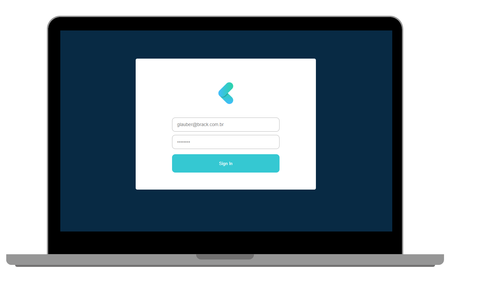

<h1 align="center">
    
</h1>

<h1 align="center">  
    
</h1>

<h4 align="center">
  React Redux Authentication
</h4>

<p align="center">
  <a href="#-project">Project</a>&nbsp;&nbsp;&nbsp;|&nbsp;&nbsp;&nbsp;
  <a href="#rocket-techs">Techs</a>&nbsp;&nbsp;&nbsp;|&nbsp;&nbsp;&nbsp;
  <a href="#rocket-Running">Running</a>&nbsp;&nbsp;&nbsp;|&nbsp;&nbsp;&nbsp;
</p>
<br>

## 💻 Project

 An simple web application to login using Redux & Saga.


## :rocket: Techs

- [Typescript](https://www.typescriptlang.org/)
- [ReactJS](https://reactjs.org/)
- [Axios](https://github.com/axios/axios)


## :notebook: Running

### Requeriments

```bash
# Clone this
$ git clone https://github.com/glauberbrack/redux-auth

# Go to your project folder
$ cd redux-auth

# Install all depencies
$ yarn

# Run your project
$ yarn start
```

#### :warning: Remember to connect one API on src/services/api

---

Glauber Brack - <a href="mailto:glauber@brack.com.br?Subject=Hello%20you">Talk to me!</a> ☕